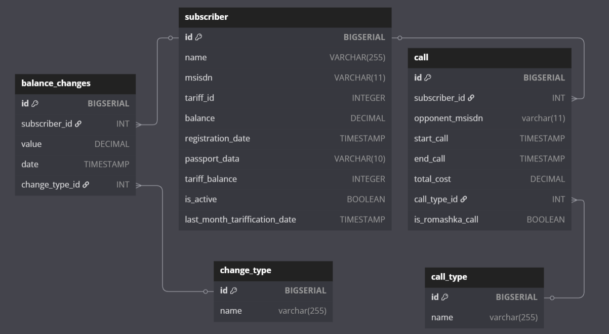

Nx Bootcamp  
Spring H2 Postgres Liquibase Lombok Mapstruct Jackson Swagger

для запуска:
поднимаем кролика и postgres
```
docker compose up --build
```
1) CDR
  
Генерация звонков между заранее определенными пользователями, для последующей отправки в BRT.


RabbitMQ management:
```
http://localhost:15672/
```
username: user  
password: password

port: 8080  

Swagger:
```
http://localhost:8080/swagger-ui/index.html
```
  
Алгоритм:

Случайно параллельно генерируются даты начал звонков в годовом промежутке (крайняя дата - вчера)  
каждой дате сопоставляются звонящий, принимающий вызов, дата окончания звонка (менее 12ч от начала)
Звонки сортируются и перебираются в порядке возрастания дат, для каждого следующего звонка проверяется не наезжает ли он на предыдущие звонки участвующих абонентов  
для каждого абонента собираются cdr записи, как только в cdr накапливается 10 звонков - она отправляется в RabbitMQ, откуда ее потом читает BRT.

2) BRT

Получение и обработка CDR отчетов, тарификация пользователей  

подключение к postgres:  
username: user  
password: password  
```
http://127.0.0.1:5430/brt_db
```
port:8081  

Swagger:  
```
http://localhost:8081/swagger-ui/index.html
```
  
Алгоритм:  
  
Получаем CDR отчет, авторизуем пользователя, проводим валидацию  
обработка отчета:  
подряд обрабатываем сообщения и отправляем данные в HRS, получаем как ответ данные о тарификации, меняем баланс, сохраняем звонок, сохраняем изменения баланса.
  
! датой списания после очередного звонка (если списание имеет место) ставится дата окончания звонка + 2 минуты !

Если дата звонка переваливает за дату помесячной тарификации, то сначала проводится помесячная тарификация (если она подразумевается в тарифе абонента).  
дата проверяется по полю "last_month_tarification_date" в таблице subscriber.

3) HRS
  
Тарификация звонков + помесячная тарификация  
  


подключение к postgres:  
username: user  
password: password
```
http://127.0.0.1:5440/hrs_db
```
port:8082

Swagger:
```
http://localhost:8082/swagger-ui/index.html
```

Алгоритм:

Обрабатываем входящие звонки и помесячную тарификацию.
  
4) CRM
     
Тарификация звонков + помесячная тарификация     


подключение к postgres:  
username: user  
password: password
```
http://127.0.0.1:5450/crm_db
```
port:8082

Swagger:
```
http://localhost:8083/swagger-ui/index.html
```
существует нормальный сваггер от аналитика 
  
  
api менеджера: basic auth admin:admin  
```
http://localhost:8083/manager/**
```
api пользователя: basic auth {msisdn}:""  (пустое поле)
```
http://localhost:8083/subscriber/**
```

Алгоритм:
взаимодействует с другими сервисами.

